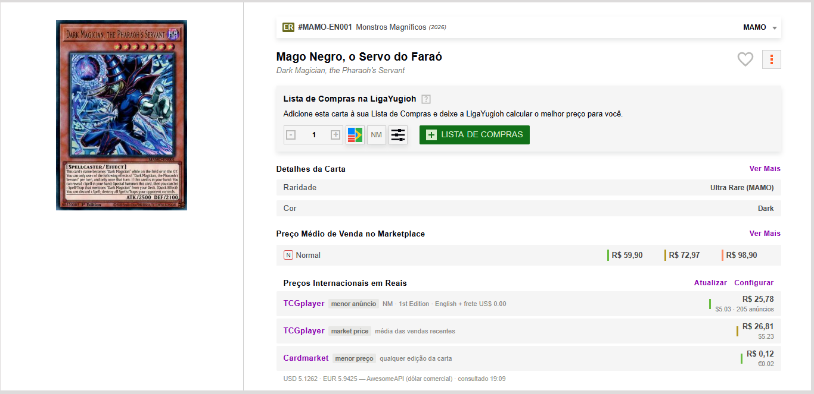
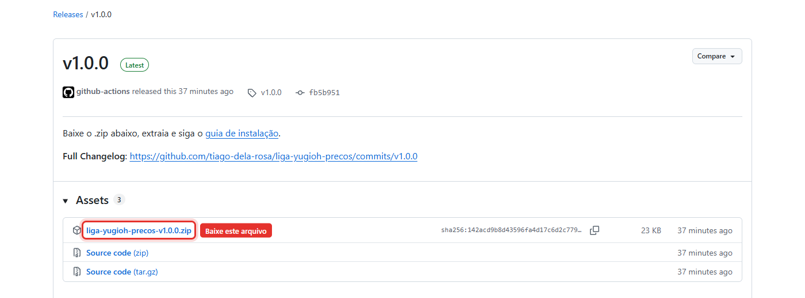
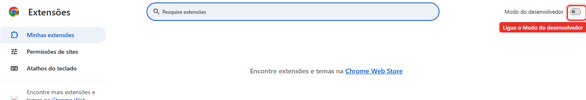
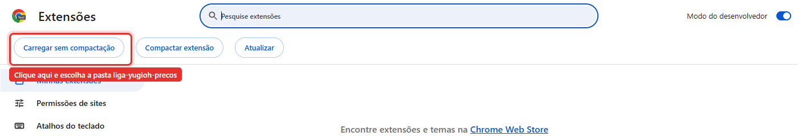
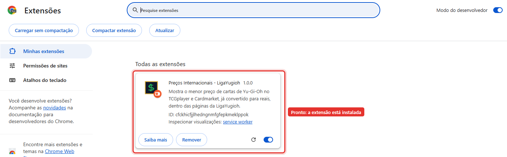
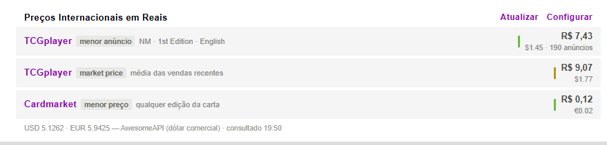
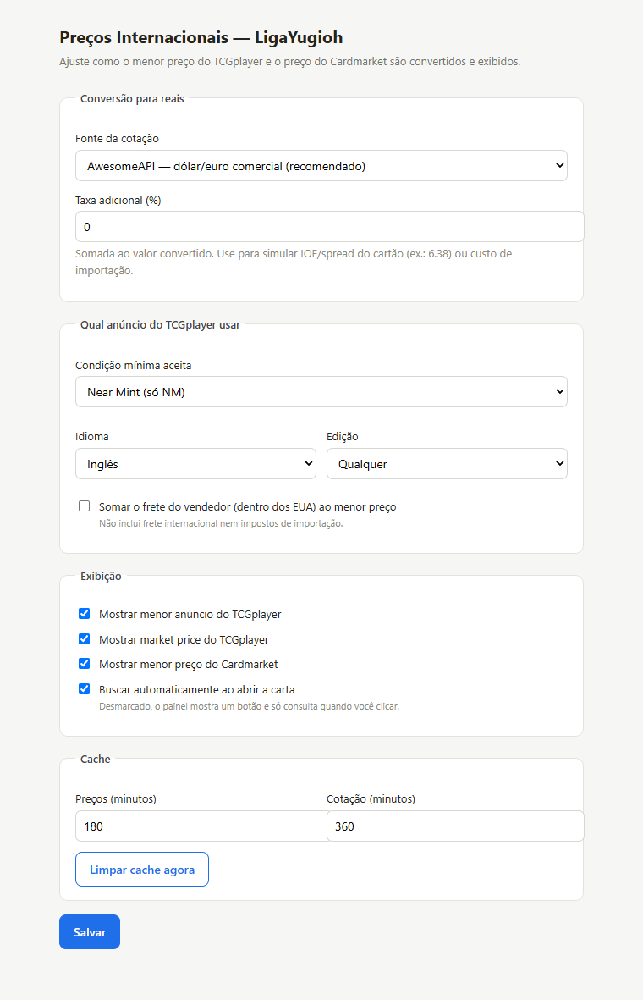
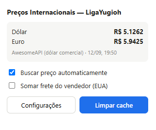

# Preços Internacionais — LigaYugioh

Extensão para Google Chrome que mostra, dentro da página da carta na
[LigaYugioh](https://www.ligayugioh.com.br/), o **menor preço no TCGplayer** e o **menor preço no
Cardmarket**, já convertidos para reais pela cotação do dia.

Sem cadastro, sem chave de API, sem servidor no meio: tudo roda no seu navegador.

<!-- Substitua pelo print do painel na página da carta -->


> Projeto **não oficial**, sem qualquer vínculo com LigaYugioh, TCGplayer, Cardmarket ou Konami.

---

## Índice

- [O que a extensão faz](#o-que-a-extensão-faz)
- [Instalação](#instalação)
- [Como usar](#como-usar)
- [Configurações](#configurações)
- [De onde vêm os dados](#de-onde-vêm-os-dados)
- [Avisos importantes](#avisos-importantes)
- [Perguntas frequentes](#perguntas-frequentes)
- [Desenvolvimento](#desenvolvimento)
- [Licença](#licença)

---

## O que a extensão faz

Ao abrir qualquer carta na LigaYugioh, um bloco **"Preços Internacionais em Reais"** aparece logo
abaixo de *"Preço Médio de Venda no Marketplace"*, no mesmo estilo visual do site:

| Linha | O que significa |
| --- | --- |
| **TCGplayer — menor anúncio** | O anúncio ativo mais barato daquela carta *naquela raridade e edição*, respeitando seus filtros de condição, idioma e edição. |
| **TCGplayer — market price** | Média das vendas recentes no TCGplayer. Boa referência de "quanto vale". |
| **Cardmarket — menor preço** | Menor preço da carta no Cardmarket (Europa), em euros. |

Cada valor aparece em **reais** com o valor original (US$ ou €) logo abaixo. O rodapé mostra a
cotação usada, a fonte e o horário da consulta.

A extensão identifica a carta pelo **código da edição** que a Liga exibe (ex.: `MAMO-EN028`) e pela
raridade, então não confunde uma *Secret Rare* com a *Ultra Rare* da mesma carta.

---

## Instalação

A extensão ainda não está na Chrome Web Store. A instalação é manual, leva 2 minutos e funciona no
**Google Chrome**, **Microsoft Edge**, **Brave** e outros navegadores baseados em Chromium.

### 1. Baixe o projeto

Clique no botão verde **Code** no topo desta página e depois em **Download ZIP**.

<!-- Substitua pelo print do botão Code > Download ZIP -->


Extraia o ZIP em uma pasta que você **não vá apagar** (ex.: `Documentos\liga-yugioh-precos`).
O Chrome carrega a extensão direto dessa pasta — se ela sumir, a extensão para de funcionar.

> Se você usa Git: `git clone https://github.com/tiago-dela-rosa/liga-yugioh-precos.git`

### 2. Abra a página de extensões

Digite na barra de endereços e pressione Enter:

```
chrome://extensions
```

(No Edge: `edge://extensions` · No Brave: `brave://extensions`)

### 3. Ative o Modo do desenvolvedor

No canto superior direito da página, ligue a chave **Modo do desenvolvedor**.

<!-- Substitua pelo print da chave "Modo do desenvolvedor" -->


### 4. Carregue a extensão

Clique em **Carregar sem compactação** e selecione a pasta que você extraiu — a pasta que contém o
arquivo `manifest.json`.

<!-- Substitua pelo print do botão "Carregar sem compactação" e da seleção da pasta -->


A extensão aparece na lista com o ícone verde de cifrão. Pronto.

<!-- Substitua pelo print da extensão instalada na lista -->


### 5. Teste

Abra qualquer carta na LigaYugioh, por exemplo:

<https://www.ligayugioh.com.br/?view=cards/card&card=W%3AP%20Fancy%20Ball%20(Secret%20Rare)&ed=0&num=>

Role até *"Preço Médio de Venda no Marketplace"* — o painel estará logo abaixo.

### Atualizando para uma versão nova

1. Baixe o ZIP novo e extraia **por cima** da mesma pasta (ou dê `git pull`).
2. Em `chrome://extensions`, clique no ícone de **recarregar** (↻) no card da extensão.

---

## Como usar

- **Abriu a carta, o preço aparece.** Por padrão a busca é automática.
- **Atualizar** (no canto do painel) força uma nova consulta, ignorando o cache.
- **Configurar** abre a página de opções.
- Os nomes **TCGplayer** e **Cardmarket** são links: clique para abrir a carta na loja e ver todos
  os anúncios.
- A barrinha colorida ao lado do valor segue o padrão da Liga: **verde** para menor preço,
  **amarela** para preço médio.

<!-- Substitua por um GIF ou print da extensão em uso -->


---

## Configurações

Clique no ícone da extensão na barra do Chrome → **Configurações** (ou em **Configurar** no painel).

<!-- Substitua pelo print da página de configurações -->


### Conversão para reais

| Opção | Para que serve |
| --- | --- |
| **Fonte da cotação** | AwesomeAPI (dólar/euro comercial), open.er-api.com ou uma cotação manual definida por você. |
| **Taxa adicional (%)** | Somada ao valor convertido. Use para simular o IOF e o spread do cartão (ex.: `6.38`) ou o custo de um redirecionador. |

### Qual anúncio do TCGplayer usar

| Opção | Para que serve |
| --- | --- |
| **Condição mínima** | De "só Near Mint" até "qualquer condição". O padrão é NM, igual ao que a Liga mostra. |
| **Idioma** | Inglês (padrão) ou qualquer idioma. |
| **Edição** | 1st Edition, Unlimited ou qualquer. |
| **Somar frete do vendedor** | Inclui o frete doméstico (dentro dos EUA) cobrado no anúncio. |

### Exibição e cache

- Ligar/desligar cada linha (menor anúncio, market price, Cardmarket).
- Busca automática ao abrir a carta, ou só quando você clicar.
- Tempo de cache dos preços (padrão 3 h) e da cotação (padrão 6 h), com botão para limpar.

O **popup** do ícone mostra a cotação em uso e tem atalhos para as opções mais comuns.

<!-- Substitua pelo print do popup -->


---

## De onde vêm os dados

| Fonte | O que fornece | Observação |
| --- | --- | --- |
| **TCGplayer** | Menor anúncio e market price, por raridade e edição | Usa a mesma API que o site do TCGplayer consome no navegador. Não é uma API oficial; pode mudar sem aviso. |
| **YGOPRODeck** | Preço do Cardmarket | API pública e gratuita. O Cardmarket não tem API aberta; esse valor é **da carta**, não da edição específica. |
| **AwesomeAPI** | Cotação USD/BRL e EUR/BRL | Dólar e euro comerciais. Se falhar, a extensão usa o open.er-api.com automaticamente. |

Todas as consultas saem do **seu** navegador, só quando você abre uma carta, e ficam em cache.
A extensão não tem servidor próprio, não coleta dados e não envia nada para ninguém.

---

## Avisos importantes

- **O valor em reais é o preço da carta lá fora**, convertido. Ele **não inclui** frete
  internacional, imposto de importação nem taxas de redirecionador. Use a *taxa adicional* nas
  configurações para aproximar seu custo real.
- Quando a carta tem mais de uma impressão com o mesmo código (ex.: reimpressão *25th
  Anniversary*), a extensão usa a **mais barata** e avisa no painel.
- Se a Liga não mostrar a raridade no nome da carta, a extensão tenta ler em *Detalhes da Carta*.
  Sem raridade, ela escolhe a impressão mais barata e avisa.
- A API do TCGplayer não é oficial. Se um dia parar de funcionar, o painel continua mostrando o que
  conseguir (Cardmarket e cotação) e informa o erro.

---

## Perguntas frequentes

**O painel não apareceu.**
Confira se a extensão está ativa em `chrome://extensions` e recarregue a página da carta (F5). O
painel só aparece em páginas de carta (`?view=cards/card`), não na busca.

**O preço parece desatualizado.**
Clique em **Atualizar** no painel. Por padrão os preços ficam 3 h em cache.

**Apareceu "produto não encontrado para esta raridade".**
A carta pode ainda não ter anúncios no TCGplayer (lançamentos muito recentes) ou a raridade que a
Liga usa não existe lá com o mesmo nome. Clique no link **TCGplayer** para conferir.

**Funciona no celular?**
Não — o Chrome para Android/iOS não aceita extensões.

**Posso confiar no valor para comprar?**
Como referência, sim. Para decidir a compra, abra o link do TCGplayer/Cardmarket e confira o anúncio
real, o frete e a reputação do vendedor.

---

## Desenvolvimento

```
manifest.json          Manifest V3
src/background.js      Service worker: rede, cache, conversão
src/content.js         Lê a carta na página e injeta o painel
src/content.css        Estilo do painel (tokens visuais da Liga)
src/shared.js          Configuração padrão e utilidades
src/options.html|js    Página de configurações
src/popup.html|js      Popup da barra de ferramentas
test/                  Teste da lógica do service worker fora do Chrome
docs/images/           Imagens usadas neste README
```

Para rodar a lógica do service worker fora do Chrome (consulta as APIs reais):

```bash
node test/test-background.mjs
```

Depois de editar qualquer arquivo, clique em **recarregar** (↻) no card da extensão em
`chrome://extensions` e dê F5 na página da carta.

Sugestões e correções são bem-vindas — abra uma *issue* ou um *pull request*.

---

## Licença

[MIT](LICENSE). Yu-Gi-Oh! é marca da Konami. LigaYugioh, TCGplayer e Cardmarket são marcas de seus
respectivos donos. Este projeto não tem relação com nenhum deles.
